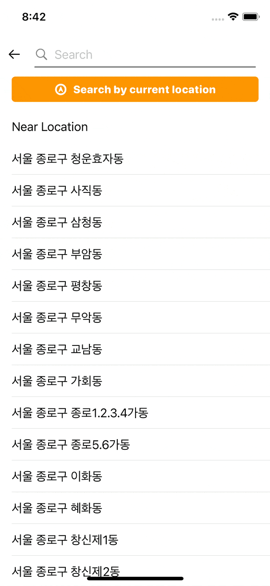
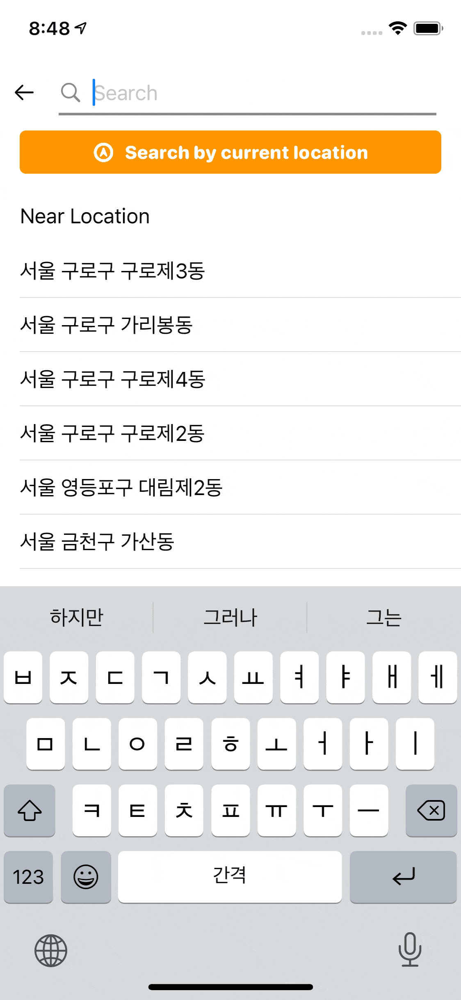
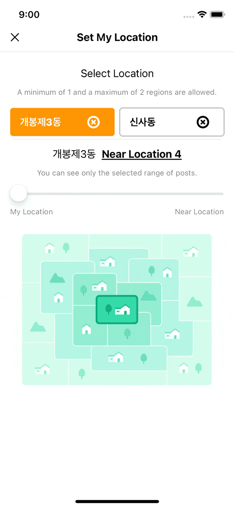
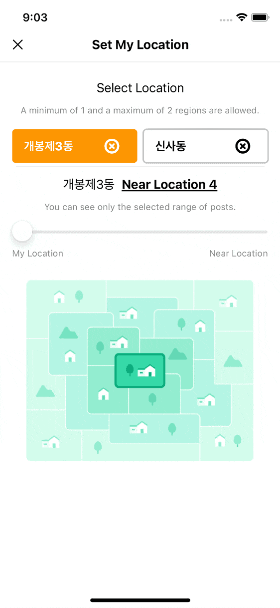
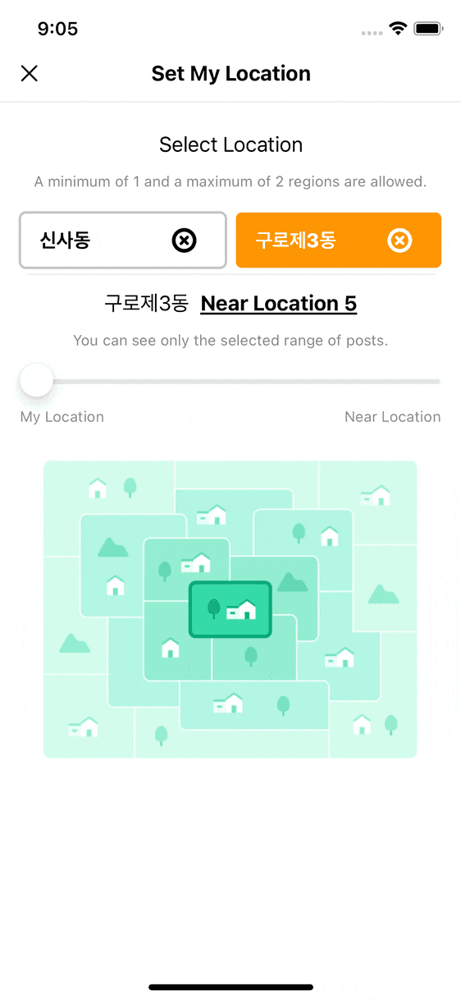
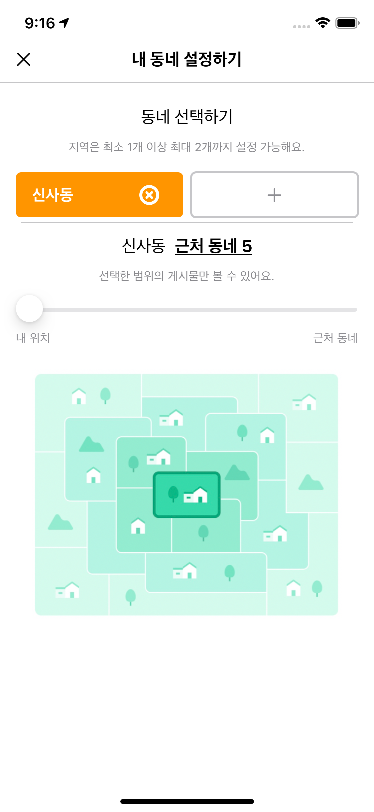

# 당근마켓 내 동네 설정하기 화면 구현

## 사용 기술
<ul>
  <li>Swift</li>
  <li>SwiftUI</li>
  <li>CoreLocation</li>
  <li>REST API Networking</li>
  <li>Combine</li>
 </ul>

## 지역 검색, 지역 리스트

- 입력창을 통해 원하는 지역만 검색할 수 있습니다. 시, 구, 동 모두 검색 가능

- 'Search by current location'을 통해 현재 위치를 기준으로 가장 가까운 지역순으로 정렬해서 보여줍니다.

- 주소 데이터는 별도의 모듈에서 만들어 진 뒤 JSON 데이터로 저장되어 있습니다. 본 프로젝트에는 포함하지 않았습니다.

- 지역을 하나도 선택 하지 않았을 때

## 지역 저장, 근처 동네 수, 리스트

- 두개의 지역을 저장할 수 있고 슬라이더를 통해 근처 동네의 범위를 설정할 수 있습니다.

## 지역 저장 및 삭제

- 저장된 지역을 저장하고 삭제 할 수 있습니다.

## 설정 저장

- 지역이나, 리스트 등 어플리케이션을 종료 후 실행해도 저장되어 그대로 남아 있습니다.

## 지역에 따른 언어 제공

- 디바이스 사용 언어에 따라 맞는 언어로 제공됩니다. (영어, 한국어 제공)

